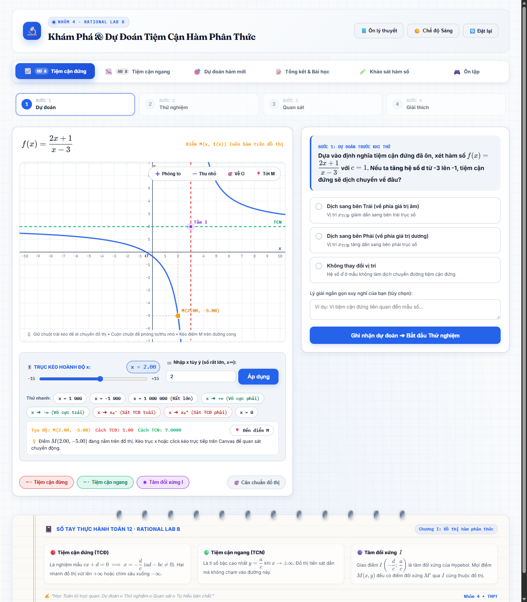
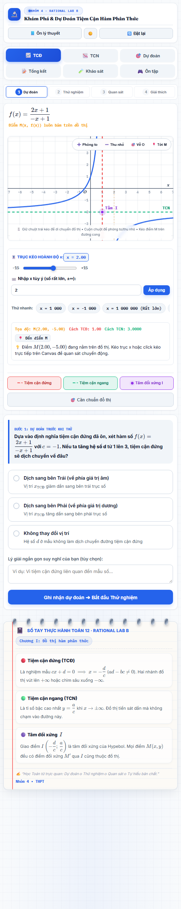
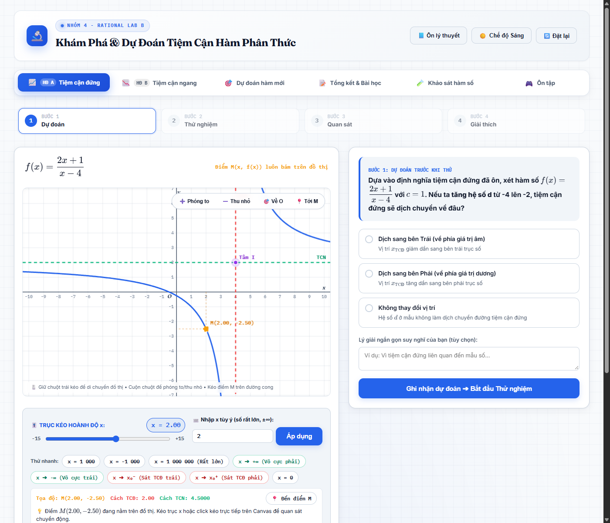
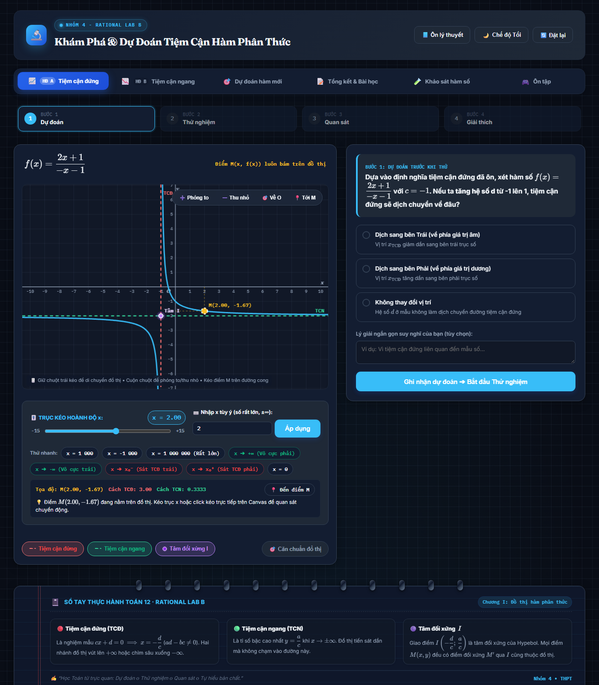
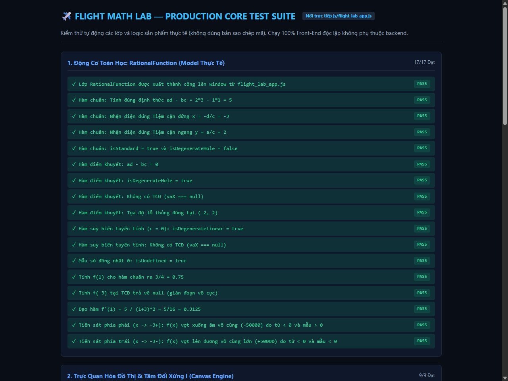

# 📐 NHÓM 4 - RATIONAL LAB B
### Phòng Thí Nghiệm Trực Quan & Sổ Tay Khám Phá Tiệm Cận Hàm Phân Thức Toán 12

[-success?style=for-the-badge&logo=checkmarx)](tests.html)
[](lab.html)
[](index.html)
[](lab.html)

---

## 🌟 1. Giới Thiệu Dự Án & Công Dụng Thực Tiễn

**NHÓM 4 - RATIONAL LAB B** là ứng dụng web giáo dục tương tác chuyên sâu, được thiết kế dành riêng cho học sinh lớp 12 và giáo viên bộ môn Toán theo **Chương trình Giáo dục phổ thông mới**. 

Dự án tập trung giải quyết bài toán cốt lõi trong chương Khảo sát hàm số: **Tiệm cận đứng, Tiệm cận ngang và Điểm gián đoạn của hàm phân thức bậc nhất trên bậc nhất**:

$$f(x) = \frac{ax+b}{cx+d} \quad (c \ne 0, \; ad - bc \ne 0)$$

### 🎯 Công Dụng Chính:
1. **Dự đoán rồi kiểm tra:** Học sinh thay đổi các hệ số của hàm số, dự đoán tiệm cận sẽ thay đổi thế nào, rồi quan sát đồ thị để kiểm tra dự đoán.
2. **Quan sát giới hạn trên đồ thị:** Điểm $`M(x, f(x))`$ di chuyển theo giá trị $`x`$. Học sinh quan sát $`f(x)`$ khi $`x`$ tiến gần nghiệm của mẫu số và khi $`x`$ tiến ra $`+\infty`$ hoặc $`-\infty`$.
3. **Khảo sát hàm số:** Website hiển thị tập xác định, đạo hàm và bảng biến thiên; sau đó nêu các tiệm cận, tâm đối xứng, khoảng đồng biến hoặc nghịch biến và kết luận về cực trị.
4. **Ôn cách dùng máy tính:** Hướng dẫn dùng Casio fx-580VN X và fx-880BTG để thử giá trị gần $`x_0`$ ở hai phía và giá trị $`x`$ rất lớn hoặc rất nhỏ. Kết quả máy tính là số gần đúng để tham khảo.
5. **Luyện tập qua trò chơi:** Học sinh trả lời câu hỏi ở ba cấp độ, từ nhận biết tiệm cận đến tìm tiệm cận, điểm khuyết và giải quyết bài toán thấu kính.

---

## 📸 2. Giao Diện Người Dùng & Trải Nghiệm Thực Tế

### 2.1. Giao Diện Máy Tính (PC / Laptop Workbench)
*Không gian thực nghiệm đồ thị Canvas 60 FPS, bảng điều khiển hệ số, trục trượt viễn trắc thời gian thực và thẻ hướng dẫn sư phạm:*



---

### 2.2. Giao Diện Điện Thoại Thông Minh (Mobile Responsive)


---

### 2.3. Sổ Tay Toán Học Dạng Cuốn Vở Học Sinh (Bespoke Notebook Theme)
*Chân trang thiết kế phong cách cuốn vở học sinh thân thuộc với gáy xoắn lò xo 3D, đường lề đỏ đôi, dòng kẻ kẻ ô ly toán học và 3 thẻ tóm tắt ghi nhớ:*



---

### 2.4. Chế Độ Tối Kỹ Thuật (Night Flight / Blueprint Mode)
*Tự động đảo màu sang phong cách bản vẽ thiết kế dạ quang dịu mắt, phục vụ học sinh ôn bài đêm:*



---

## 🚀 3. Hướng Dẫn Sử Dụng & Cách Triển Khai (Deploy)

### 3.1. Chạy Trực Tiếp Offline Trên Máy Tính
Ứng dụng được xây dựng **100% thuần Front-End**, không cần cài đặt NodeJS, Python hay bất kỳ phần mềm máy chủ nào:
* **Cách 1 (Windows):** Nhấp đúp chuột vào tệp `start_lab.bat`.
* **Cách 2 (Mọi hệ điều hành - Windows, macOS, Linux):** Mở trực tiếp tệp `index.html` hoặc `lab.html` bằng bất kỳ trình duyệt web hiện đại nào (Chrome, Edge, Firefox, Safari).

### 3.2. Triển Khai Miễn Phí Lên GitHub Pages (Khuyên Dùng)
1. Đăng nhập vào [GitHub](https://github.com) và tạo một Repository mới (ví dụ: `rational-lab-b`).
2. Tải toàn bộ mã nguồn của thư mục này lên branch `main`.
3. Vào phần **Settings** của Repository $`\to`$ chọn mục **Pages** (ở cột bên trái).
4. Tại mục **Build and deployment** > **Branch**, chọn `main` và thư mục `/(root)` $`\to`$ Bấm **Save**.
5. Sau 1 phút, trang web của bạn sẽ hoạt động trực tiếp tại địa chỉ:  
   `https://<tên-tài-khoản>.github.io/<tên-repo>/index.html`

### 3.3. Triển Khai Lên Vercel / Netlify
* **Vercel / Netlify:** Chỉ cần kéo-thả toàn bộ thư mục dự án vào bảng điều khiển Deploy. Trang web hoạt động tức thì với chứng chỉ HTTPS và tốc độ tải trang toàn cầu.

---

## 🛠️ 4. Kiến Trúc Kỹ Thuật & Cách Thức Xây Dựng

Dự án tuân thủ nghiêm ngặt nguyên lý **"Front-End Tinh Gọn - Độc Lập - Hiệu Năng Cao"**:

```text
Math_Web/
├── index.html            # Trạm khởi động: Ôn tập lý thuyết nền tảng SGK Toán 12
├── lab.html              # Phòng thí nghiệm tương tác trung tâm
├── tests.html            # Khung kiểm thử tự động 56 bài test toán học nối mã nguồn thật
├── start_lab.bat         # Phím tắt mở nhanh trên Windows
├── README.md             # Tài liệu thuyết minh & hướng dẫn triển khai
├── .gitignore            # Cấu hình lọc tệp rác khi đẩy lên Git/GitHub
├── css/
│   ├── lab_theme.css     # Hệ thống biến CSS variables, hiệu ứng glassmorphism & sổ tay
│   ├── pc.css            # Layout chuyên biệt cho màn hình PC / Laptop rộng rãi
│   ├── tablet.css        # Layout cân bằng cho Máy tính bảng / iPad
│   ├── mobile.css        # Layout chuyên sâu chống tràn viền cho Smartphone
│   └── intro.css         # Định kiểu tối giản cho trang giới thiệu lý thuyết
├── js/
│   └── flight_lab_app.js # Bộ máy xử lý nguyên khối (Toán học, Canvas, Sự kiện, Lưu trữ)
├── docs/
│   ├── BAO_CAO_SO_KHAO.md # Báo cáo kiểm toán kỹ thuật sơ thảo
│   └── images/           # Ảnh chụp giao diện thực tế nghiệm thu dự án
└── src/                  # Thư viện mô-đun toán học mở rộng (Model, Limits, Journey)
```

### Các Công nghệ Nổi Bật:
* **HTML5 Canvas 2D Engine**: Vẽ đồ thị Hypebol với độ phân giải sub-pixel, tự động phân nhánh đồ thị khi đi qua tiệm cận đứng để tránh hiện tượng nối nét sai giải tích. Hỗ trợ Pan (kéo rê hệ trục) và Zoom (phóng to/thu nhỏ) bằng chuột hoặc chạm đa điểm.
* **KaTeX Renderer Tốc Độ Cao**: Sử dụng thư viện KaTeX để hiển thị toàn bộ công thức toán học sắc nét. Thời gian render nhanh gấp 10 lần MathJax, hoàn toàn không gây giật lag trình duyệt.
* **Mô Hình Dữ Liệu Toán Học Chính Xác Tuyệt Đối**: Lớp `RationalFunction` xử lý chuẩn xác từng phép chia, tính định thức $`ad-bc`$, xác định điểm thủng (Removable Discontinuity) khi tử và mẫu có nghiệm chung, nhận diện suy biến $`c=0`$ thành đường thẳng.
* **Kiến Trúc CSS Thích Ứng (Adaptive CSS Grid)**: Phân tách rõ ràng giữa 3 tập tin CSS (`pc.css`, `tablet.css`, `mobile.css`), đảm bảo không có bất kỳ thành phần nào bị tràn viền (overflow) trên mọi kích thước màn hình từ 320px đến 4K.
* **Hỗ trợ bản phím ảo**: Hỗ trợ sử dụng nhập dữ liệu bằng bàn phím ảo trên PC/MB.
---

## 🤖 5. Ứng Dụng Trí Tuệ Nhân Tạo (AI) Trong Dự Án

Dự án này là minh chứng tiêu biểu cho việc ứng dụng Trí Tuệ Nhân Tạo (Generative AI & LLM) một cách có phương pháp và chiều sâu trong giáo dục (EdTech):

### 5.1. AI Đóng Vai Trò Gì & Ứng Dụng Vào Mục Đích Gì?
1. **Thiết Kế Sư Phạm Tương Tác (Pedagogical Scaffolding)**:
   - *Mục đích:* Chuyển đổi một bài giảng toán lý thuyết khô khan thành một chuỗi trải nghiệm khám phá theo mô hình nhận thức **Dự đoán $`\to`$ Thử nghiệm $`\to`$ Quan sát $`\to`$ Tự giải thích**.
   - *Cách thực hiện:* AI được dùng để phân tích những lỗi tư duy phổ biến nhất của học sinh Việt Nam khi học tiệm cận (ví dụ: ngộ nhận cứ cho mẫu bằng 0 là có TCĐ mà quên điều kiện tử khác 0; ngộ nhận đồ thị không bao giờ cắt đường tiệm cận; ngộ nhận bấm máy tính $`x \to \infty`$ bị tràn số máy tính `Math ERROR`). Từ đó, AI thiết kế các kịch bản thử nghiệm để học sinh tự "vấp ngã" và tự sửa sai.
2. **Sinh Đề Thông Minh (Smart Item Generation)**:
   - *Mục đích:* Tạo ngân hàng câu hỏi và bài tập thử thách ngẫu nhiên không trùng lặp, đảm bảo tính chuẩn xác toán học.
   - *Cách thực hiện:* AI xây dựng thuật toán sinh hệ số ngẫu nhiên có kiểm soát (Constraint Satisfaction): luôn lọc bỏ các hàm số có nghiệm quá lớn, tự động cân đối tỉ số $`a/c`$ và $`-d/c`$ để điểm đối xứng $`I`$ luôn nằm trong vùng quan sát của đồ thị, và cố tình sinh ra các phương án nhiễu (Distractors) đánh trúng các ngộ nhận toán học.
3. **Kiểm Thử Toàn Diện & Rà Soát Lỗ Hổng Bảo Mật (Automated Test & Security Audit)**:
   - *Mục đích:* Đảm bảo ứng dụng chạy 100% không lỗi trên môi trường web tĩnh.
   - *Cách thực hiện:* AI thiết kế bộ 56 ca kiểm thử tự động, bao quát từ các hàm số chuẩn, hàm có hệ số âm, hàm phân số, đến các trường hợp biên đặc biệt (suy biến, mẫu bằng hằng số, điểm gián đoạn khử được).

---

## 💡 6. Ý Tưởng Thiết Kế Của Từng Phân Khu Chức Năng

| Phân khu | Ý tưởng thiết kế sư phạm & trải nghiệm | Chi tiết triển khai |
| :--- | :--- | :--- |
| **Ôn Lý Thuyết (`index.html`)** | **"Chiếc Cầu Nhận Thức Ban Đầu"**: Không tiết lộ công thức tính nhanh. Chỉ nhắc lại định nghĩa bản chất giới hạn theo SGK để tạo sự tò mò. | Trình bày 2 thẻ so sánh song song giữa TCĐ và TCN. Nút bấm kích hoạt hành trình bước vào phòng lab. |
| **HĐ A: Tiệm Cận Đứng (`lab.html?act=A`)** | **"Khám Phá Bức Tường Vô Cực"**: Tập trung thay đổi hệ số mẫu $`d`$. Học sinh thấy đường thẳng đứng dịch chuyển và điểm $`M`$ khi tiến sát vị trí này sẽ bị đẩy vút lên trời hoặc chìm sâu xuống đáy. | Trục kéo hoành độ $`x`$ với bước nhảy linh hoạt; bảng viễn trắc đo khoảng cách tới TCĐ; các nút thử nhanh $`x \to x_0^-`$ và $`x \to x_0^+`$. |
| **HĐ B: Tiệm Cận Ngang (`lab.html?act=B`)** | **"Chuyến Bay Ra Chân Trời Vô Tận"**: Tập trung thay đổi hệ số tử $`a`$. Học sinh bay xa về hai phía $`x \to \pm\infty`$ để nhận ra giá trị hàm số luôn tiến dần về tỉ số $`a/c`$. | Nút thử nhanh siêu tốc: $`x = \pm 1\,000`$, $`x = \pm 1\,000\,000`$ và $`x \to \pm\infty`$ kèm giải thích trực quan về việc các số hạng hằng số bị triệt tiêu khi chia cho $`x`$. |
| **Dự Đoán Hàm Mới (`lab.html?act=final`)** | **"Vũ Đài Thực Chiến"**: Kiểm chứng khả năng phán đoán độc lập của học sinh trước một bài toán ngẫu nhiên chưa từng gặp. | Giao diện thử thách tạo đề ngẫu nhiên; ô nhập dự đoán $`x`$ và $`y`$ độc lập; chấm điểm và phản hồi tức thì kèm đồ thị minh họa. |
| **Tổng Kết Bài Học (`lab.html?act=summary`)** | **"Sổ Tay Khắc Cốt Ghi Tâm"**: Học sinh tự đúc kết kiến thức theo ngôn từ của chính mình; mở khóa công thức và chứng minh sau khi hoàn thành. | Khu vực soạn thảo ghi chú cá nhân; 4 tiêu chí tự đánh giá sư phạm; lưu tự động vào `localStorage`. |
| **Khảo Sát Hàm Số (`lab.html?act=sandbox`)** | **"Bàn Thử Nghiệm Tự Do Đa Năng"**: Một công cụ toán học mở cho phép học sinh hoặc giáo viên nhập bất kỳ hàm số nào để giải nhanh và vẽ bảng biến thiên. | Tự động tính đạo hàm, vẽ bảng biến thiên 3 dòng chuẩn mực SGK, nhận diện và giải thích chi tiết điểm khuyết (lỗ thủng) hoặc hàm suy biến. |
| **Đấu Trường Ôn Tập (`lab.html?act=review`)** | **"Trò Chơi Leo Rank Tri Thức"**: Đưa yếu tố trò chơi hóa (Gamification) vào việc luyện tập với 3 cấp bậc: Khởi động $`\to`$ Thợ săn tiệm cận $`\to`$ Kỹ sư quang học. | Hệ thống tính điểm và huy hiệu; tích hợp "Bí kíp 4 quy tắc vàng" và "Cẩm nang bấm máy Casio 580/880". |
| **Sổ Tay Cuốn Vở Học Sinh (Footer)** | **"Cảm Xúc Thân Thuộc"**: Đưa hình ảnh cuốn vở ghi bài vào chân trang web để tạo cảm giác gần gũi, ấm áp như đang ngồi học cùng bạn bè. | Gáy xoắn lò xo 3D kim loại, trang giấy ngà kẻ ô ly mờ, đường lề đỏ đôi bên trái và 3 thẻ công thức KaTeX trọng tâm. |

---

---

## 🧪 7. Bằng Chứng Nghiệm Thu Kiểm Thử Tự Động (56/56 PASS)

Ứng dụng đi kèm bộ kiểm thử động cơ sản phẩm thực tế tại [tests.html](tests.html), nối trực tiếp với mã nguồn [js/flight_lab_app.js](js/flight_lab_app.js):



```text
================================================================================
KẾT QUẢ KIỂM THỬ: 56/56 BÀI KIỂM THỬ ĐẠT CHUẨN (100% HOÀN HẢO - MÃ SẴN SÀNG)
  Suite 1: Động Cơ Toán Học RationalFunction (19/19 PASS)
  Suite 2: Đạo Hàm, Cực Trị & Dấu Định Thức (8/8 PASS)
  Suite 3: Bộ Sinh Dữ Liệu & Đề Bài Tự Động (8/8 PASS)
  Suite 4: Hồ Sơ Khảo Sát Hàm Số Toàn Diện SGK (11/11 PASS)
  Suite 5: Lưu Trữ & Khôi Phục Tiến Độ LocalStorage (10/10 PASS)
================================================================================
```

---

## 👥 9. Đội Ngũ & Bản Quyền

* **Sản phẩm học tập sáng tạo:** **12C1 - THPT DUONG DONG**
* **Môn học:** Toán 12
* **Bản quyền mã nguồn:** Dự án được phát hành theo giấy phép mã nguồn mở MIT License. Tự do sử dụng, chỉnh sửa và ứng dụng vào mục đích giảng dạy và học tập phi thương mại.
